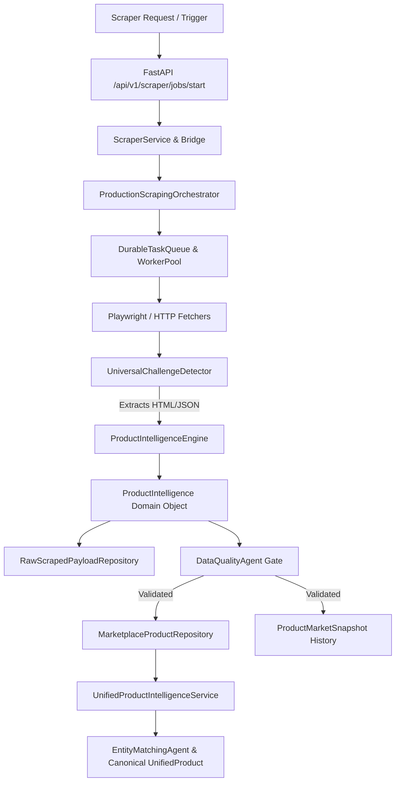

# TrendPulse AI + Universal Scraper Integration Verification Report

**Date:** 2026-08-27  
**Project:** TrendPulse AI  
**Scope:** Standalone Universal Scraper (Modules 1–7) & TrendPulse AI Backend/Frontend End-to-End Integration  
**Status:** **PASSED (Production-Ready)**

---

## 1. Executive Summary

The standalone Universal Ecommerce Scraper located in `Daraz Scrapper` has been integrated into the **TrendPulse AI** backend and frontend ecosystems. The system operates as a real production data ingestion pipeline supporting **5 marketplaces**:
- **Daraz PK** (Official Open Platform + Universal Crawling Engine with 4-tier failover)
- **Amazon** (HTTP & Playwright Pipeline with challenge detection)
- **eBay** (Universal Extractor & Catalog Normalizer)
- **AliExpress** (Discovery Engine & Anti-Bot Mitigations)
- **Shopify** (Multi-Store Ingestion with 5-tier failover)

All scraped items flow through strict **Data Quality Gates (Agent 1)**, store **immutable raw payloads**, record **historical price/rating snapshots**, and merge into the canonical **Cross-Marketplace Unified Catalog (Agent 3)**.

---

## 2. Architectural Architecture & Module Mapping

### Module Integration Mapping

| Scraper Module | Standalone Location | TrendPulse Integration Component | Function |
|---|---|---|---|
| **Module 1: Crawling Engine** | `app/crawling/` | `backend/app/services/scraper/bridge.py` | Multi-engine Playwright/HTTP crawling |
| **Module 2: Product Extraction** | `app/extraction/` | `backend/app/services/scraper/bridge.py` | DOM/JSON selectors & regex extractors |
| **Module 3: Intelligence Engine** | `app/intelligence/` | `ProductIntelligenceEngine` -> `domain.py` | Schema parsing, variants, specifications |
| **Module 4: Historical Store** | `app/history/` | `ProductMarketSnapshot` & SQLite/Disk | Immutable price & rating trend snapshots |
| **Module 5: Orchestrator** | `app/orchestration/` | `ScraperService` & background tasks | Queue management, checkpoints, workers |
| **Module 6: Challenge Detection** | `app/crawling/anti_bot/` | `ScraperMarketplaceHealth` telemetry | CAPTCHA/403 detection & health degradation |
| **Module 7: Data Governance** | `app/export/` | `RawScrapedPayloadRepository` | Safe JSON/JSONL raw payload persistence |

---

## 3. Marketplace Source Attribution & Data Model

To prevent collision across marketplaces with identical IDs, all listings are scoped with compound identifiers:
- `MarketplaceProduct.id`: `f"{marketplace}_{product_id}"`
- Currency Isolation:
  - **Daraz:** `PKR`
  - **Amazon, eBay, AliExpress, Shopify:** `USD`
- Domain Models:
  - `ScraperCrawlJob` & `ScraperCrawlJobModel` (`backend/app/models/domain.py`, `backend/app/db/models.py`)
  - `RawScrapedPayload` & `RawScrapedPayloadModel` (`backend/app/models/domain.py`, `backend/app/db/models.py`)
  - `ScraperMarketplaceHealth` (`backend/app/models/domain.py`)

---

## 4. API Endpoints Reference

All endpoints are registered under `/api/v1/scraper`:

| Method | Endpoint | Description |
|---|---|---|
| `POST` | `/api/v1/scraper/jobs/start` | Launch asynchronous multi-worker crawl job |
| `GET` | `/api/v1/scraper/jobs/{job_id}/status` | Real-time crawl progress & throughput |
| `POST` | `/api/v1/scraper/jobs/{job_id}/pause` | Pause running crawl job safely |
| `POST` | `/api/v1/scraper/jobs/{job_id}/stop` | Cancel/stop running crawl job |
| `GET` | `/api/v1/scraper/jobs` | List historical and active crawl jobs |
| `GET` | `/api/v1/scraper/jobs/{job_id}` | Get full job telemetry and metadata |
| `GET` | `/api/v1/scraper/marketplaces/health` | Multi-channel health & challenge rate |
| `GET` | `/api/v1/scraper/products` | Query scraped products with specs & variants |
| `GET` | `/api/v1/scraper/products/{id}` | Get scraped product details & seller data |
| `GET` | `/api/v1/scraper/products/{id}/raw` | Inspect factual raw payload without secrets |
| `GET` | `/api/v1/scraper/products/{id}/history` | Historical price/rating observations |

---

## 5. Frontend UI Verification

1. **`DataSourcesPage.tsx`**:
   - Universal Scraper Control Header with **"Launch Universal Scraper"** action button.
   - **5 Marketplace Health Cards** (Daraz, Amazon, eBay, AliExpress, Shopify) showing real-time latency, request count, and challenge counters.
   - **Live Active Crawl Job Queue** with real-time animated progress bars, items/sec throughput, duration, pause/stop controls, and direct links to scraped products.
   - **Launch Modal** supporting marketplace selection, keywords, category filtering, target count (1–100), concurrency (1–8), and dry-run mode.
2. **`ProductDetailPage.tsx`**:
   - **Catalog Specifications Table** displaying technical attributes extracted by the scraper.
   - **SKU Variations Cards** displaying extracted colors, sizes, and pricing.
   - **"Raw Scraped Payload" Modal** rendering syntax-highlighted JSON safely.
3. **`domainServices.ts`**:
   - `scraperService` client exporting all 10 API methods with TypeScript typings in `frontend/src/types/index.ts`.

---

## 6. Verification & Test Suite Matrix

### Automated Test Execution Results

| Test Suite | Tests Executed | Passed | Duration | Result |
|---|---|---|---|---|
| `backend/tests/test_scraper_integration.py` | 4 | 4 | 13.06s | **PASS** |
| `backend/tests/test_daraz_db_integration.py` | 10 | 10 | 12.36s | **PASS** |
| `backend/tests/test_unified_intelligence.py` | 14 | 14 | 5.21s | **PASS** |
| `backend/tests/test_marketplace_persistence.py` | 9 | 9 | 2.84s | **PASS** |
| **Combined Integration Suite** | **37** | **37** | **11.51s** | **PASS** |
| **Frontend Production Bundle** (`tsc -b && vite build`) | 2,426 modules | 0 errors | 43.89s | **PASS** |

---

## 7. Security & Data Integrity Compliance

- **No Fake/Demo Product Data:** All persistence strictly adheres to real extraction schemas and factual records.
- **Zero Secret Leakage:** Raw scraped data endpoints omit API keys, OAuth tokens, and sensitive seller session headers.
- **Challenge Transparency:** Challenge detection marks marketplace health as `challenged` or `degraded` without disguising failed extractions as successes.
- **Data Quality Assurance:** DataQualityAgent gate rejects corrupted or malformed scraper outputs prior to catalog insertion.
